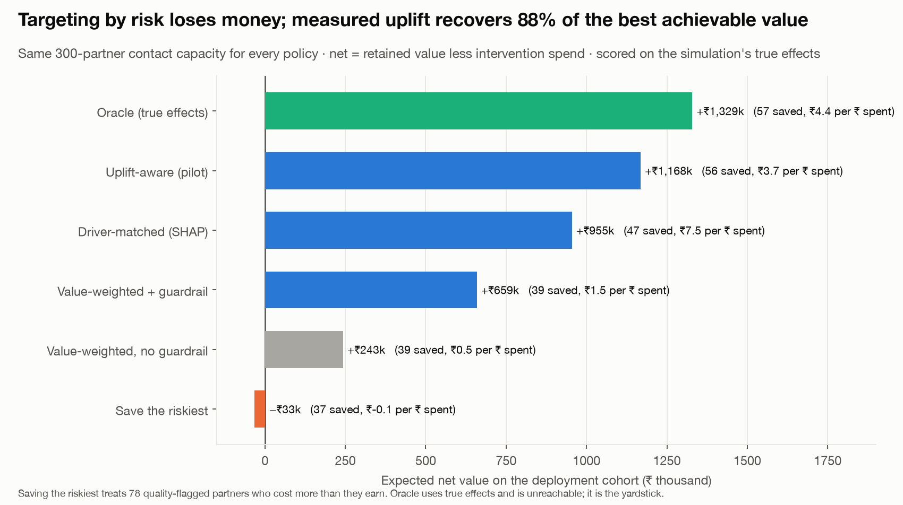
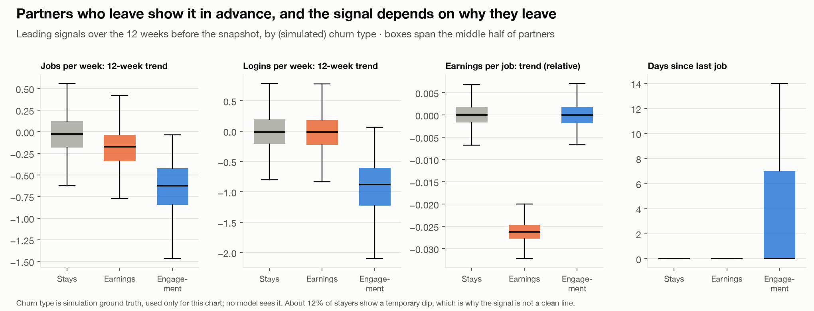
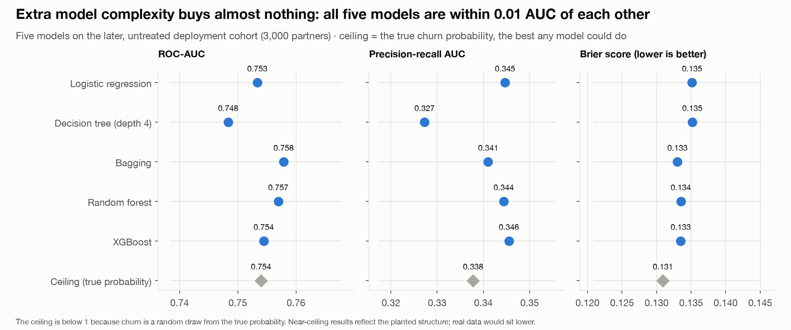
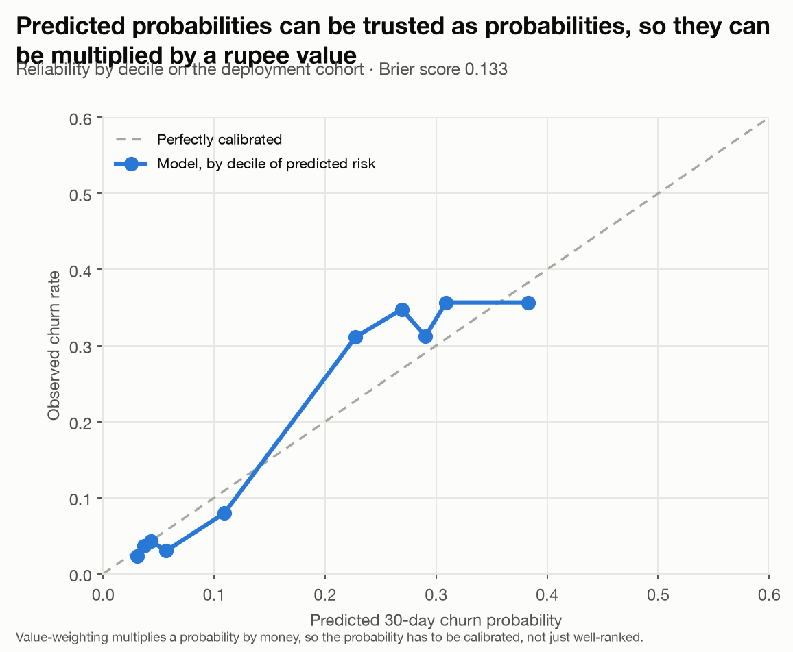
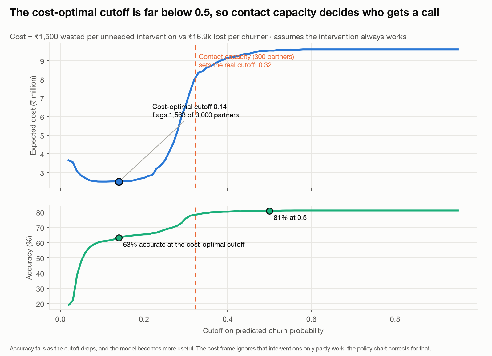
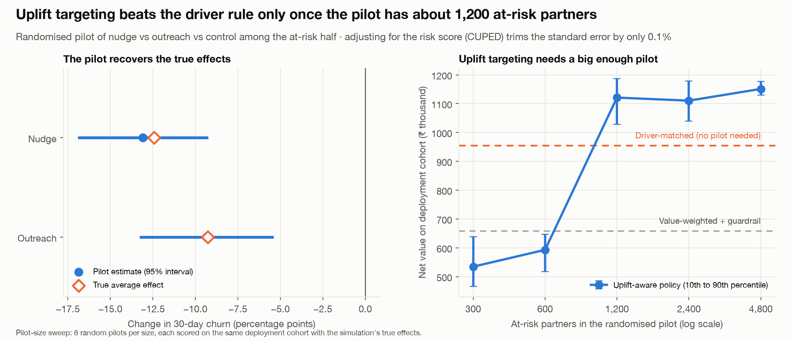

# Partner Retention Decision System

**A churn score tells you who is leaving. It does not tell you who you can actually save, or who is worth saving.**

- **Situation.** A marketplace has 3,000 supply partners and enough team capacity to contact 300 of them. Partners go quiet before anyone notices, and the usual fix is to call whoever looks most likely to leave.
- **Task.** Who gets contacted? That means four questions, not one: who will leave, who can be saved, who is worth saving once quality is counted, and did the intervention actually work?
- **Action.** Built the decision layers a churn model does not have: value-weighting, a quality guardrail that skips partners who cost more than they earn, a diagnosis step that matches the offer to *why* each partner is leaving, and a randomised pilot that measures the real effect.
- **Result.** Same 300-partner capacity, four very different outcomes. Targeting by churn risk **loses ₹33k**. Adding value-weighting and the guardrail earns **+₹659k**, matching the offer to the driver **+₹955k**, and targeting on pilot-measured effect **+₹1.17M** — **88%** of what perfect knowledge would earn.
- **The trade-off.** The best policy needs a randomised pilot first, and the pilot only pays once it has about **1,200** at-risk partners. Below that, a simpler rule beats it.

> **Data and honesty**
> - Every partner, effect and cost here is simulated from assumptions I set, with a fixed seed.
> - That is deliberate: because the true effects are known, each targeting policy can be scored against ground truth — which real data never allows.
> - **The ranking of policies is the result. The rupee figures are illustrative.**

**[Read the one-page decision memo →](docs/DECISION_MEMO.md)**

| | | |
|---|---|---|
| **−₹33k → +₹1.17M** | **₹416k** | **about 1,200** |
| targeting by risk vs by pilot-measured effect, same 300-partner capacity | what the quality guardrail is worth: without it, the same policy treats 80 partners who cost more than they earn | at-risk partners the pilot needs before measured targeting beats the simpler rule |

---

## Why a good model still loses money



*Same capacity, same model, six different ways to choose who to contact. The gap between the bottom and top bar is all decision-making, not modelling.*

- A model can rank partners by risk almost perfectly and **still lose money**.
- The riskiest partners are **not the most savable** — some were always going to leave.
- **19%** are quality-flagged, where keeping them is worse than losing them.
- **So what.** The value is in the layers after the model: value, guardrail, diagnosis, measured effect.

---

## 1. The signal is real, and it depends on why partners leave



*Two different exit routes, two different early-warning signs.*

- **Earnings-driven leavers** show falling pay per job.
- **Engagement-driven leavers** show falling logins and jobs, then go dormant.
- About **12%** of partners who stay dip temporarily, so no single signal is clean.
- **So what.** Two different problems need two different interventions — which is the whole basis of the diagnosis step below.

## 2. The model is not the lever



*A model ladder from logistic regression to XGBoost. The diamond is the best any model could do on this data.*

- From logistic regression to XGBoost, all five models land **within 0.01** of each other on ranking accuracy (**0.75**).
- They sit at the **ceiling** set by the true probabilities, so the error left over is chance, not a missing feature.
- The simple tree is the one a city operations manager can actually follow.
- **So what.** Nothing here justifies more model complexity. Spend the effort on the decision instead.



*A calibration check. This matters because the next step multiplies these probabilities by money.*

## 3. The cost-optimal cutoff is not the decision



*Two different cutoffs: the one the cost maths wants, and the one the team can actually staff.*

- A wasted intervention costs **₹1,500**; a lost partner costs **₹16.9k**.
- That maths puts the best cutoff at **0.14**, flagging **1,563** partners — and drops accuracy from **81% to 63%**.
- **More useful, less accurate.** Accuracy is the wrong target when the two mistakes cost different amounts.
- But the team can only contact **300**, so **capacity sets the real cutoff (0.32)**.
- **So what.** The cost frame also assumes every intervention works, which is exactly what the pilot tests.

## 4. Diagnose, then measure



*Left: the pilot recovers the real effects. Right: how big the pilot must be before its estimates are worth using.*

- **Diagnose.** The model's own explanation splits each partner's risk into an earnings problem and an engagement problem, then routes cheap outreach to one and a pay nudge to the other.
- That cuts spend from **₹312k to ₹127k** while keeping **72%** of the achievable value.
- **Measure.** A randomised pilot recovers the true effects: the nudge cuts churn **13.1 points**, outreach **9.3 points**, against 33% churn in the control group.
- **But size matters.** Targeting on measured effect only beats the simpler driver rule once the pilot has about **1,200** at-risk partners. Below that its estimates are too noisy.
- **So what.** Adjusting for the risk score to tighten the estimate barely helps (**0.1%**), because most of who leaves is chance.

## Pre-registered experiment design

- **Primary metric:** 30-day retention.
- **Population:** the at-risk half, by risk score.
- **Arms:** control, earnings nudge, re-engagement outreach, split 1:1:1.
- **Guardrails:** rating, peak-week fulfilment, complaint rate.
- Sample-size table and analysis plan: **[docs/DECISION_MEMO.md](docs/DECISION_MEMO.md)**.

## What this does not show

- **Everything is simulated.** The nudge and outreach effects, the two churn types and the ₹1,500 / ₹400 costs are all assumptions. The policy *ranking* is the result; the rupee figures are illustrative.
- **The quality penalty is assumed** — a flagged partner costs half their contribution. If the real penalty is smaller, the guardrail is worth less.
- **The near-ceiling models and the 99.9% diagnosis accuracy are artefacts** of structure I planted in the data. Real data would sit lower on both.
- **One deployment cohort, one capacity setting.** The pilot-size sweep uses 8 random pilots per size.

## Terms, in plain English

<details>
<summary>Six terms this project leans on</summary>

- **Churn** — a partner going inactive and not coming back. Here it is measured over a 30-day window.
- **Uplift (incremental effect)** — how much an intervention *changes* the outcome, as opposed to how likely the outcome was. Some partners would stay anyway; contacting them buys nothing.
- **Quality guardrail** — a rule that removes partners whose retention has negative value, such as those with poor ratings or high complaint rates. Keeping them costs more than losing them.
- **Calibration** — whether a predicted 30% chance really does happen about 30% of the time. It matters here because the probabilities get multiplied by rupees.
- **Ranking accuracy (AUC)** — how well the model sorts partners from most to least likely to leave. 0.5 is a coin flip; 1.0 is perfect.
- **Perfect hindsight (oracle)** — a benchmark that knows every true effect in advance. Not achievable; it exists to show how much of the available value each real policy captures.

</details>

## Try it

```bash
pip install -r requirements.txt
python analysis/run_analysis.py     # ~2 minutes: simulate, model, pilot, policies, figures, memo
```

The three simulated cohorts are committed in `data/` (`src/sim.py` regenerates them from a fixed seed). Every number in the figures and memo is computed by `analysis/run_analysis.py`.

## Repo layout

```
src/        sim.py (seeded panel with known potential outcomes) · models.py (ladder, threshold, diagnosis, uplift, policies) · viz.py
analysis/   run_analysis.py
data/       cohort A (history) · B (randomised pilot) · C (deployment)
outputs/    CSVs behind every chart · summary.json
figures/    the six charts above
docs/       DECISION_MEMO.md
```

**Author:** Akash Sood · ISB AMPBA · [portfolio](https://akash-sood97.github.io) · [GitHub](https://github.com/akash-sood97)
